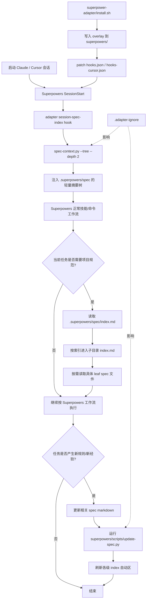
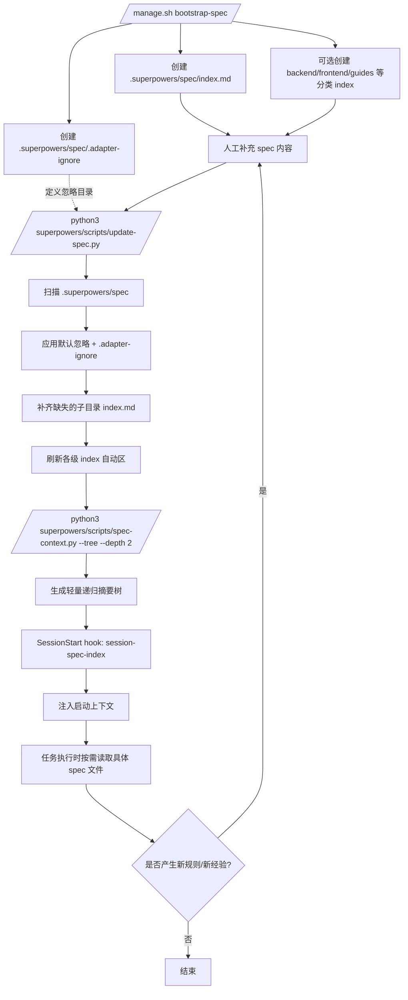

# Superpowers Adapter 集成说明

本文说明这套 `superpower-adapter` 做了什么改造、如何实现 spec 的渐进式披露、如何接入到 `superpowers/` 中，以及如何实际使用。

如果你想了解用户在 Claude Code 等工具中如何通过 Superpowers command / skill 使用 adapter，请先看：[`ADAPTER_USER_FLOW_CN.md`](./ADAPTER_USER_FLOW_CN.md)

如果你在开发 adapter 或设计测试，请先看：[`ADAPTER_DEVELOPMENT_CN.md`](./ADAPTER_DEVELOPMENT_CN.md)

如果你只想看快速命令摘要，请看：[`QUICKSTART_CN.md`](./QUICKSTART_CN.md)

---

## 1. 这套 adapter 改了什么

这次改造的目标是：

- 以 **Superpowers 为主框架**
- 在项目侧增加一套 **可插拔、可重放** 的 spec 机制
- 让 spec 存放在 `.superpowers/spec/`
- 借鉴 Trellis 的“按需读取 spec”思路，但**不依赖 Trellis runtime**

因此新增了一个独立目录：

```text
superpower-adapter/
```

这个目录不是业务代码目录，而是一个**本地 adapter 源码目录**。它负责把 overlay 写入 `superpowers/`，并在后续升级 `superpowers/` 后重新安装这些能力。

### 1.1 新增的能力

adapter 目前提供了这些能力：

- 安装 / 卸载 / 校验 / 状态检查
- SessionStart 注入轻量 spec 摘要树
- SessionStart 注入当前 plan sidecar 的轻量状态
- `update-spec` 自动维护索引链
- `spec-context` 输出递归摘要树或定向读取 spec
- `.adapter-ignore` 自定义忽略目录
- `bootstrap-spec` 初始化 `.superpowers/spec`
- `bootstrap-spec --preset web|backend|fullstack`
- `export-manifest` 导出 adapter + spec 快照
- `doctor` 健康检查
- `release-check` 发布前检查
- `workflow-gate` 阶段前置检查
- `spec_select_context` 候选推荐与 sidecar 写入
- `spec_update_check` 回写前判断

### 1.2 写入到 Superpowers 的内容

adapter 会把以下 overlay 安装进 `superpowers/`：

```text
superpowers/
├── skills/spec-progressive-disclosure/SKILL.md
├── skills/plan-context-sidecar/SKILL.md
├── commands/update-spec.md
├── commands/check-workflow.md
├── scripts/update-spec.py
├── scripts/spec-context.py
├── scripts/spec_common.py
├── scripts/plan_context_common.py
├── scripts/plan-context.py
├── scripts/workflow-gate.py
├── scripts/spec_select_context.py
├── scripts/spec_update_check.py
├── hooks/session-spec-index
└── hooks/session-plan-context
```

同时会修改：

- `superpowers/hooks/hooks.json`
- `superpowers/hooks/hooks-cursor.json`

用于在 SessionStart 时追加 spec 摘要注入。

---

## 2. spec 是如何渐进式披露的

### 2.1 核心原则

这套实现不是把整个 `.superpowers/spec/` 目录一次性注入上下文，而是遵循下面的顺序：

1. 先读入口 `index.md`
2. 再读子目录 `index.md`
3. 只有在当前任务真正需要时，才读叶子 spec 文件

也就是说，**索引优先，细节按需**。

### 2.2 入口约束

`.superpowers/spec/` 下唯一强约束是：

```text
.superpowers/spec/index.md
```

其他目录结构不强制，可以按项目自己定义。

例如：

```text
.superpowers/spec/
├── index.md
├── backend/
│   ├── index.md
│   └── *.md
├── frontend/
│   ├── index.md
│   └── *.md
└── guides/
    ├── index.md
    └── *.md
```

### 2.3 `update-spec` 现在的语义

当前实现已经不是“只刷新索引”的单层语义，而是：

- **先做 spec 更新决策**：什么时候更新、写到哪里、写成什么样
- **再走执行层**：一键入口或分阶段脚本

1. **正文更新层**
   - 可以直接走一键入口：

   ```bash
   python3 superpowers/scripts/spec_update_run.py "error handling" "Error normalization" "Prevent inconsistent backend error shapes." "Normalize backend error payloads" "Keep user-facing messages stable"
   ```

   - 也可以走分阶段路径：

   ```bash
   python3 superpowers/scripts/spec_select_target.py "error handling"
   python3 superpowers/scripts/spec_update_prompt.py backend/error-handling.md
   python3 superpowers/scripts/spec_update_template.py backend/error-handling.md "Error normalization" "Prevent inconsistent backend error shapes."
   python3 superpowers/scripts/spec_apply_update.py backend/error-handling.md "Error normalization" "Prevent inconsistent backend error shapes." "Normalize backend error payloads" "Keep user-facing messages stable"
   ```

   这五者分别负责：
   - `spec_update_run.py`：一键完成“选目标 + 写正文 + 刷新索引”
   - `spec_select_target.py`：基于 hint 选择目标 leaf spec
   - `spec_update_prompt.py`：输出正文更新提示
   - `spec_update_template.py`：输出可直接粘贴的正文模板
   - `spec_apply_update.py`：把结构化更新块直接写入目标 spec 正文；如果标题相同，则做字段级合并：Why 刷新、Rules 去重合并、Validation Notes 尽量保留

2. **索引刷新层**
   - 再运行 `update-spec.py`，刷新各级 index 自动区

也就是说，现在 `update-spec` 的命令语义已经更接近 Trellis：
- 先定义更新原则和内容质量要求
- 再用脚本执行具体落盘

### 2.4 `update-spec.py` 做了什么

`superpowers/scripts/update-spec.py` 负责自动维护索引链：

- 如果缺少 `.superpowers/spec/index.md`，先创建
- 为有内容的子目录自动补 `index.md`
- 在各级 `index.md` 里自动生成：
  - 子索引列表
  - 叶子 spec 文件列表
  - 轻量摘要
- 只更新自动区域：

```markdown
<!-- superpower-adapter:auto:start -->
<!-- superpower-adapter:auto:end -->
```

这意味着：
- 你可以手工维护 index 的说明文字
- adapter 只负责维护自动生成区
- 不会覆盖人工写的正文

### 2.5 `spec-context.py` 做了什么

`superpowers/scripts/spec-context.py` 提供三种读取方式：

- `--file <path>`
  - 读取一个具体 spec 文件
- `--category <dir>`
  - 读取某个目录下的 `index.md`
- `--tree --depth N`
  - 输出递归摘要树

默认 SessionStart 使用的是：

```bash
python3 superpowers/scripts/spec-context.py --tree --depth 2
```

所以启动时看到的是**轻量摘要树**，不是全文。

### 2.6 如何避免无关 spec 进入视图

这套 adapter 支持两层忽略机制：

#### 默认忽略

以下目录名默认忽略：

- `draft`
- `archive`
- `examples`

#### 自定义忽略

还可以在：

```text
.superpowers/spec/.adapter-ignore
```

里扩展忽略目录名，例如：

```text
private-notes
old-specs
scratch
```

忽略规则会影响：
- `update-spec.py` 生成索引
- `spec-context.py --tree`
- SessionStart 注入的摘要树
- `export-manifest` 的 effective view

---

## 3. 是如何接入到 Superpowers 中的

### 3.1 接入方式

当前 adapter 的最终交付目标已经调整为：**优先修改用户本地已安装的 Superpowers 插件目录**，而不是默认修改当前仓库里的 `superpowers/` 源码 checkout。

也就是说：

- 如果检测到 Claude Code 已安装 Superpowers 插件
  - adapter 默认作用于插件安装目录
- 如果没有检测到已安装插件
  - 才回退到当前仓库里的 `./superpowers`
- 也可以显式传入目标路径

接入不是直接手改 `superpowers/`，而是通过：

```text
superpower-adapter/install.sh
```

将 overlay 同步进 `superpowers/`。

这保证了：
- adapter 是可重放的
- `superpowers/` 升级后可以重新安装
- 改动边界清晰

### 3.2 Hook 接入

adapter 使用：

```text
superpower-adapter/lib/hook_patch.py
```

去安全修改：

- `superpowers/hooks/hooks.json`
- `superpowers/hooks/hooks-cursor.json`

它会把 `session-spec-index` 和 `session-plan-context` 追加到 SessionStart 中。

### 3.3 plan sidecar 是怎么工作的

保持原生 Superpowers plan 文件路径不变：

```text
docs/superpowers/plans/YYYY-MM-DD-<feature>.md
```

给每个 plan 增加同 stem 的 sidecar 目录：

```text
docs/superpowers/plans/YYYY-MM-DD-<feature>.context/
├── plan.jsonl
├── implement.jsonl
├── review.jsonl
└── state.json
```

再用一个轻量指针文件记录当前活跃 plan：

```text
.superpowers/current-plan
```

推荐的 Git 策略：
- 提交 `docs/superpowers/plans/<stem>.context/`
- 默认不提交 `.superpowers/current-plan`，把它作为本地工作状态并加入 `.gitignore`

语义约束是：

- `plan.jsonl` 是 planning 阶段选定的共同基线 context
- `implement.jsonl` 是实现阶段补充
- `review.jsonl` 是评审阶段补充
- 实现阶段优先消费 `plan.jsonl + implement.jsonl`
- 评审阶段优先消费 `plan.jsonl + review.jsonl`
- sidecar 缺失或明显不足时，才回退到 `.superpowers/spec` 的自由发现路径

用户入口是 `/check-workflow planning`，底层会执行 sidecar 初始化和 planning context 写入：

```bash
python3 superpowers/scripts/workflow-gate.py planning --plan docs/superpowers/plans/<stem>.md --hint "<task keywords>"
```

`plan-context.py` 保留为执行层 helper，可用于渲染和校验：

```bash
python3 superpowers/scripts/plan-context.py render --phase implement
python3 superpowers/scripts/plan-context.py render --phase review
python3 superpowers/scripts/plan-context.py verify --current
```

在第一阶段补强后，`plan-context.py` 执行层还新增了：

- `add --no-dedupe`
- `add --replace-existing`
- `render --max-full <n>`
- `render --max-chars <n>`
- `render --json`
- `render --no-dedupe`

这使 sidecar 从简单追加日志，变成了“可去重、可控预算、可机器消费”的上下文层。

### 3.4 workflow gate 是怎么工作的

`workflow-gate.py` 把原先主要依赖 skill 文本约束的流程检查，补成了可执行的前置 gate：

```bash
python3 superpowers/scripts/workflow-gate.py planning --plan docs/superpowers/plans/<stem>.md --hint "<task keywords>"
python3 superpowers/scripts/workflow-gate.py implement
python3 superpowers/scripts/workflow-gate.py review
python3 superpowers/scripts/workflow-gate.py completion --summary "<task summary>"
```

返回语义：

- `OK`：可以继续
- `WARN`：建议补齐，但由人决定是否继续
- `BLOCK`：应先修复 plan / sidecar / selected context 问题

当前 gate 语义大致为：

- planning：plan 无效时阻断；sidecar 未初始化时警告
- implement：缺少 current plan、sidecar 或 planning-selected context 时阻断
- review：缺少 planning-selected context 时阻断；缺少 review-specific context 时警告
- completion：没有 current plan 时只警告；存在 durable knowledge 信号时提醒考虑回写 spec

### 3.5 selector 和 update-check 是怎么补进来的

第二阶段补强主要解决了“读侧还是太靠 agent 自觉”和“completion 前要不要回写 spec 还只是轻量提示”这两个问题。

#### `spec_select_context.py`

它负责：

- 根据 hint 做候选推荐
- 结合 phase 调整候选 mode
- 输出文本或 JSON
- 可直接 `--write-sidecar` 把候选写进对应 phase 的 sidecar

示例：

```bash
python3 superpowers/scripts/spec_select_context.py "error handling" --phase implement --limit 5
python3 superpowers/scripts/spec_select_context.py "error handling" --phase implement --json
python3 superpowers/scripts/spec_select_context.py "error handling" --phase implement --write-sidecar
```

这让读侧能力从“只靠 skill 告诉 agent 应该怎么选”，进一步变成“程序先推荐候选，再由 agent 或脚本把选择结果写进 sidecar”。

#### `spec_update_check.py`

它负责在任务结束前独立判断：

- 这次工作是否可能产生 durable implementation knowledge
- 是否应考虑运行 `spec_update_run.py`

示例：

```bash
python3 superpowers/scripts/spec_update_check.py --summary "normalize backend error contract"
python3 superpowers/scripts/spec_update_check.py --summary "normalize backend error contract" --changed-file src/backend/api/error_handler.py --json
```

当前输出等级：

- `NO_UPDATE_NEEDED`
- `RECOMMEND_UPDATE`
- `STRONGLY_RECOMMEND_UPDATE`

### 3.6 为什么不直接把全文注入 SessionStart

因为全文注入会导致：

- 启动上下文过重
- 无关规范污染当前任务
- spec 越长，启动越慢
- 失去“按需读取”的好处

所以 adapter 的设计是：

- SessionStart 只注入摘要树
- 实现阶段再按需读细节

这正是“渐进式披露”的核心。

---

## 4. Superpowers + adapter 总流程图

下面这张图描述的是 **Superpowers 主框架 + adapter + `.superpowers/spec`** 的总流程：



### 4.1 命令生命周期图

下面这张图专门描述 `bootstrap-spec -> update-spec -> spec-context -> SessionStart` 这条链：



### 图的重点

这张图表达的不是“adapter 替代 Superpowers”，而是：

- **Superpowers 负责主流程**
- **adapter 负责 spec 能力增强**
- **`.superpowers/spec` 负责项目规范存储**

三者分工明确：

| 层 | 职责 |
|---|---|
| Superpowers | 主工作流、skills、commands、hooks |
| adapter | spec 渐进式披露、索引维护、安装/校验/健康检查 |
| `.superpowers/spec` | 项目规范的持久化目录 |

---

## 5. 如何使用

用户日常使用 adapter 时，应优先通过安装到 Superpowers 的 command / skill 入口完成操作；本节中直接列出的 Python 命令用于说明 command 背后的执行层和排查方式，不应被视为普通用户的主要交互入口。

### 5.1 首次安装 adapter

在当前仓库根目录执行：

```bash
./superpower-adapter/install.sh
./superpower-adapter/verify.sh
```

或：

```bash
./superpower-adapter/manage.sh install
./superpower-adapter/manage.sh verify
```

### 5.2 初始化 spec 目录

最小初始化：

```bash
./superpower-adapter/manage.sh bootstrap-spec /path/to/project
```

这会创建：

- `.superpowers/spec/index.md`
- `.superpowers/spec/.adapter-ignore`

### 5.3 用 preset 初始化

例如：

```bash
./superpower-adapter/manage.sh bootstrap-spec /path/to/project --preset web
./superpower-adapter/manage.sh bootstrap-spec /path/to/project --preset backend
./superpower-adapter/manage.sh bootstrap-spec /path/to/project --preset fullstack
```

preset 含义：

- `web` -> `frontend guides`
- `backend` -> `backend guides`
- `fullstack` -> `backend frontend guides`

也可以和显式分类参数混用：

```bash
./superpower-adapter/manage.sh bootstrap-spec /path/to/project --preset backend api-contracts
```

### 5.4 更新 spec 正文 + 刷新索引链

如果你已经知道 hint、title、why 和 rules，推荐直接使用一键入口：

```bash
python3 superpowers/scripts/spec_update_run.py "error handling" "Error normalization" "Prevent inconsistent backend error shapes." "Normalize backend error payloads" "Keep user-facing messages stable"
```

如果你需要更细粒度控制，再走分阶段路径：

先选目标 spec：

```bash
python3 superpowers/scripts/spec_select_target.py "error handling"
```

再生成正文更新提示、模板，或直接自动写入正文：

```bash
python3 superpowers/scripts/spec_update_prompt.py backend/error-handling.md
python3 superpowers/scripts/spec_update_template.py backend/error-handling.md "Error normalization" "Prevent inconsistent backend error shapes."
python3 superpowers/scripts/spec_apply_update.py backend/error-handling.md "Error normalization" "Prevent inconsistent backend error shapes." "Normalize backend error payloads" "Keep user-facing messages stable"
```

最后刷新索引链：

```bash
python3 superpowers/scripts/update-spec.py
```

更新时应始终记住：
- `index.md` 是入口与导航，不是正文主存储
- 叶子 spec 文件才是主要知识载体
- `guides/` 更适合 checklist / 思考提示
- `backend/` 与 `frontend/` 更适合实现规则与 contract

或通过命令语义使用 `update-spec`。

### 5.5 查看递归摘要树

```bash
python3 superpowers/scripts/spec-context.py --tree --depth 2
```

### 5.6 定向查看 spec

读取具体文件：

```bash
python3 superpowers/scripts/spec-context.py --file backend/error-handling.md
```

读取目录索引：

```bash
python3 superpowers/scripts/spec-context.py --category backend
```

### 5.7 阶段前检查

```bash
python3 superpowers/scripts/workflow-gate.py planning --plan docs/superpowers/plans/<stem>.md --hint "<task keywords>"
python3 superpowers/scripts/workflow-gate.py implement
python3 superpowers/scripts/workflow-gate.py review
python3 superpowers/scripts/workflow-gate.py completion --summary "normalize backend error contract"
```

### 5.8 用 selector 选 spec

```bash
python3 superpowers/scripts/spec_select_context.py "error handling" --phase implement --limit 5
python3 superpowers/scripts/spec_select_context.py "error handling" --phase implement --json
python3 superpowers/scripts/spec_select_context.py "error handling" --phase implement --write-sidecar
```

### 5.9 在回写前先做 update 检查

```bash
python3 superpowers/scripts/spec_update_check.py --summary "normalize backend error contract"
python3 superpowers/scripts/spec_update_check.py --summary "normalize backend error contract" --changed-file src/backend/api/error_handler.py --json
```

### 5.10 日常检查

查看状态：

```bash
./superpower-adapter/manage.sh status
```

健康检查：

```bash
./superpower-adapter/manage.sh doctor /path/to/project
```

导出快照：

```bash
./superpower-adapter/manage.sh export-manifest /path/to/project ./superpower-adapter/manifest-output.json
```

发布前检查：

```bash
./superpower-adapter/manage.sh release-check /path/to/project
```

### 5.8 升级 Superpowers 后怎么做

如果将来升级了 `superpowers/`，重新执行：

```bash
./superpower-adapter/install.sh
./superpower-adapter/verify.sh
```

或者直接：

```bash
./superpower-adapter/manage.sh release-check /path/to/project
```

这样就能把 adapter overlay 重新写回新版 `superpowers/`。

---

## 6. 一句话总结

这套实现的本质是：

> **让 Superpowers 继续做主流程，让 adapter 把 `.superpowers/spec` 变成一套可安装、可升级重放、支持渐进式披露的项目规范系统。**

它不是把 Trellis 运行时搬过来，而是借鉴 Trellis 的思路，把“索引优先、细节按需、规范可维护”这套能力落到了 Superpowers 上。
