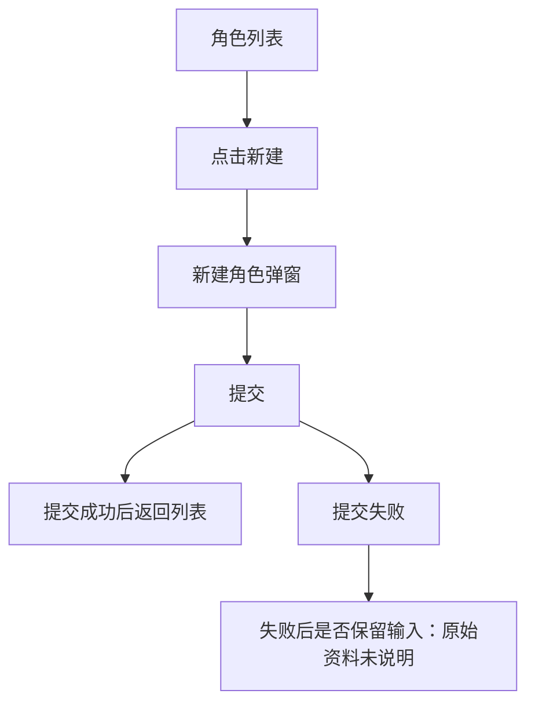

# Lanhu 输出包改造方案

## 1. 改造目标

Lanhu 输出包的定位是：**把原始 PRD、蓝湖设计稿、截图、补充说明等资料，翻译成一份完整、清晰、低噪点、便于 Superpowers 消费的需求输入包**。

Lanhu 不生成最终产品 spec，不替代 Superpowers 的后续工作。它只负责把原始需求中对实现有约束的信息整理清楚，让 Superpowers 能基于该输入继续完成 spec、计划、任务拆解和验收标准定义。

核心目标：

- 保留原始需求的完整性，不丢字段、控件、页面、状态、流程和约束。
- 降低输出噪点，避免背景、目标、分享式说明、重复流程说明干扰 Superpowers。
- 将 HTML demo 与 `prd.md` 分工清楚，避免同一需求事实被两份文件长篇重复。
- 固定输出包文件结构，但不固定 `prd.md` 正文主题目录，让 AI 根据需求形态选择最清晰的组织方式。
- 用明确边界和未说明处理规则防止 AI 过度臆想。

---

## 2. 职责边界

### 2.1 Lanhu 应该做

Lanhu 应只做原始需求的转译、整理和可视化表达：

- 翻译和整理原始 PRD / 蓝湖 / 设计稿中的需求事实。
- 梳理页面、模块、字段、控件、状态、交互路径和系统响应。
- 将设计稿中的 UI 结构、控件关系、页面层级翻译成可理解的需求表达。
- 生成 1:1 映射原始需求页面结构与交互路径的 HTML demo。
- 标记原始资料中未说明、冲突或不确定的内容。
- 对 Superpowers 有直接价值的信息优先输出。

### 2.2 Lanhu 不应该做

Lanhu 不应输出 Superpowers 后续会生成或判断的内容：

- 不输出验收标准。
- 不输出最终 spec。
- 不输出实现方案、技术选型、组件选型、接口设计、数据库设计。
- 不输出开发任务、任务拆解、milestone、工作量评估。
- 不输出测试用例、测试矩阵、QA checklist。
- 不输出独立证据映射表。
- 不推断背景目标、使用者画像、业务价值。
- 不把原始资料未说明的内容补成确定规则。

---

## 3. 输出文件结构

Adapter 只需要约束 Lanhu 输出包的文件结构，不需要固定 `prd.md` 内部主题目录。

### 3.1 有设计稿 / 需要交互 demo 的场景

```text
role-prd/
  prd.md
  design/
    index.html
    assets/
```

说明：

- `prd.md`：需求规则、约束、边界和待确认问题的主文档。
- `design/index.html`：原始需求的可交互结构镜像。
- `design/assets/`：HTML demo 需要引用的图片、截图、局部设计稿或静态资源。

### 3.2 无设计稿 / 不需要交互 demo 的场景

可输出单文件：

```text
role-prd.md
```

或在需要统一目录结构时输出：

```text
role-prd/
  prd.md
```

无设计稿时不强制生成 HTML demo。

---

## 4. `prd.md` 输出原则

`prd.md` 不固定主题目录。AI 应根据原始需求形态选择最清晰的组织方式，可以按页面、流程、模块、业务对象、状态或权限差异组织。

但 `prd.md` 的内容必须聚焦对 Superpowers 有直接价值的需求信息。

### 4.1 应优先包含的信息

`prd.md` 应优先承载 HTML 不容易稳定表达、但会影响后续 spec / plan / task 的信息：

- 精简需求范围。
- 字段规则：必填、格式、长度、默认值、可编辑性、空值含义等。
- 数据规则：筛选、排序、状态枚举、字段依赖、数据范围等。
- 权限 / 角色 / 数据范围差异：仅当原始资料涉及。
- 系统响应规则：提交成功、提交失败、删除、保存、刷新、跳转等。
- 状态触发条件：空态、加载态、错误态、禁用态、选中态、编辑态等。
- 边界条件和异常情况。
- 原始资料未说明、冲突或需要确认的问题。

### 4.2 不应包含的信息

`prd.md` 不应输出对 Superpowers 噪点较高的内容：

- 背景与目标，除非其中包含明确需求约束；若包含约束，应抽取到对应规则中。
- 用户画像或使用者推断，除非会影响权限、页面可见性或操作范围。
- 长篇需求范围说明；需求范围只需精简清单。
- 分享式、宣讲式、产品价值说明。
- HTML demo 已经清楚呈现的布局、控件类型和点击路径的长篇复述。
- 验收标准、实现建议、测试用例、任务拆解。

### 4.3 需求范围写法

需求范围只需精简说明原始资料覆盖了什么，不需要长篇背景描述。

推荐：

```md
## 需求范围

本需求覆盖：

- 角色列表
- 新建角色
- 编辑角色
- 删除角色
- 权限配置

待确认：

- 权限生效机制
- 角色删除后已绑定用户的处理方式
- 接口字段定义
```

不推荐：

```md
## 背景与目标

为了提升运营效率和后台权限管理灵活性，本需求旨在围绕角色管理体系……
```

---

## 5. HTML demo 输出原则

`design/index.html` 是原始需求的**可交互结构镜像**，用于让人和 Superpowers 直观看到页面、控件、状态和交互路径。

HTML demo 应 1:1 复刻原始需求表达出来的页面结构、控件关系、状态和交互路径，但不是生产级前端实现，也不是第二份完整 PRD 正文。

### 5.1 HTML demo 应该 1:1 的部分

HTML demo 应忠实映射：

- 页面清单。
- 页面模块。
- 字段和控件。
- 按钮和操作入口。
- 弹窗、抽屉、tab、dropdown、展开收起等交互结构。
- 用户操作路径。
- 系统响应的可视化结果。
- 原始资料明确出现的状态。
- 原始资料明确的界面文案。

### 5.2 HTML demo 不需要 1:1 的部分

HTML demo 不追求：

- 像素级视觉还原。
- 精确颜色、字号、间距、阴影、动效。
- 生产级响应式布局。
- 真实接口请求。
- 真实数据处理。
- 完整校验系统。
- 复杂脚本或框架代码。
- 长篇 PRD 正文渲染。

### 5.3 HTML demo 不能做的部分

HTML demo 不得：

- 为了让 demo 顺畅而新增原始资料没有表达的业务规则。
- 把未说明的交互写成确定结论。
- 因为“更合理”而调整原始流程或页面结构。
- 输出生产前端实现方案。
- 承载验收标准、测试用例或任务拆解。

### 5.4 HTML 布局建议

推荐布局：

```text
左侧章节导航 + 右侧激活章节内容
```

左侧可以导航到：

- 页面
- 模块
- 弹窗
- 状态
- 关键流程

右侧只展示当前激活章节内容，避免长页面滚动和重复阅读干扰核对。

---

## 6. HTML 与 `prd.md` 的分工

核心原则：**同一类需求事实只保留一个主承载；另一个文件最多做轻量引用或补充。**

### 6.1 判断标准

如果信息通过“看见 / 点击”比读文字更清楚，优先放 HTML：

- 页面布局。
- 模块位置关系。
- 字段和控件出现在哪里。
- 点击后打开哪个弹窗或面板。
- tab / dropdown / 展开收起等交互结构。
- 页面状态切换。
- 控件之间的视觉层级。

如果信息必须通过规则文本才能准确理解，优先放 `prd.md`：

- 字段必填、格式、长度、默认值。
- 数据范围、筛选、排序、枚举含义。
- 权限、角色、数据可见性差异。
- 提交成功 / 失败后的系统行为。
- 状态触发条件。
- 边界条件。
- 待确认问题。

### 6.2 主承载矩阵

| 内容类型 | 主承载 | `prd.md` 是否重复 | 说明 |
|---|---|---|---|
| 页面布局 | HTML | 不重复 | Markdown 最多列页面清单 |
| 控件位置 | HTML | 不重复 | 不再长篇写“按钮位于右上角” |
| 控件类型 | HTML | 不重复 | HTML 已是真实控件，不再重复“类型：输入框” |
| 弹窗 / 抽屉打开 | HTML | 不完整复述 | Markdown 只保留规则摘要 |
| Tab / 切换 / 展开收起 | HTML | 不完整复述 | Markdown 只写切换后的业务含义 |
| 字段必填 / 格式 / 长度 | `prd.md` | HTML 可轻标 | 规则以 Markdown 为准 |
| 状态枚举含义 | `prd.md` | HTML 可展示样例 | 业务含义写 Markdown |
| 提交成功 / 失败规则 | `prd.md` | HTML 可模拟 | HTML 不作为唯一规则来源 |
| 权限差异 | `prd.md` | HTML 可切角色展示 | 规则以 Markdown 为准 |
| 空态 / 错误态视觉 | HTML | Markdown 只写触发规则 | HTML 展示样子，Markdown 写触发条件或未说明 |
| 待确认问题 | `prd.md` | HTML 可轻提示 | 详情集中在 Markdown |
| 验收标准 | 不输出 | 不输出 | 留给 Superpowers |
| 实现方案 | 不输出 | 不输出 | 留给后续实现 |

### 6.3 HTML 已呈现的交互，`prd.md` 如何处理

HTML 已经清楚呈现的交互和流程，`prd.md` 不应完整复述，只保留规则级摘要。

例如 HTML 已经演示：

```text
点击新建角色 → 打开新建角色弹窗
```

`prd.md` 不应再长篇描述弹窗如何打开、位于哪里、包含哪些可见控件。可以写成：

```md
### 新建角色

- 入口：角色列表页「新建角色」。
- 表单规则：角色名称必填；角色描述是否必填未说明。
- 权限配置规则：原始资料未说明是否支持全选 / 半选 / 继承。
- 提交结果：原始资料未说明成功提示、失败提示、是否关闭弹窗。
```

---

## 7. 反臆想规则

为了允许 `prd.md` 灵活组织内容，同时避免 AI 过度臆想，需要明确以下规则。

### 7.1 未说明信息不得写成确定结论

错误：

```md
提交失败后保留表单输入。
```

正确：

```md
原始资料未说明提交失败后是否保留表单输入。
```

### 7.2 常见产品逻辑不能自动补齐

错误：

```md
手机号输入错误时展示红色错误提示。
```

除非原始资料明确说明，否则不能写成确定规则。

正确：

```md
原始资料要求手机号为 11 位数字，但未说明格式错误时的提示方式。
```

### 7.3 不为了章节完整而补内容

如果原始资料没有权限差异，不输出权限章节。

如果原始资料没有异常态，不自动补异常态。

如果原始资料没有用户角色说明，不推断使用者。

### 7.4 Demo 占位必须显式标注

HTML 中如果为了展示页面结构使用示例数据，应标注：

```text
示例数据，仅用于展示页面结构
```

不能让 Superpowers 误以为示例数据是产品真实规则。

### 7.5 不确定项集中收敛

不要在文档各处反复输出大量“可能”“建议”“应该”。

未说明、冲突、待确认内容应集中收敛到 `prd.md` 的待确认区域，HTML 中只做轻量提示。

---

## 8. 状态 / 流程图输出原则

状态 / 流程图是按需输出的高密度需求结构表达，用于帮助 Superpowers 快速理解复杂状态关系、流程分支和跨页面流转。

它不是固定必填章节。只有当原始资料明确包含多状态、多步骤、多分支或生命周期时，才应在 `prd.md` 中输出状态 / 流程图。

### 8.1 适合输出状态 / 流程图的场景

当原始需求包含以下内容时，可以输出状态 / 流程图：

- 多页面跳转。
- 多步骤操作。
- 审批、提交、发布、撤回、驳回、停用等状态生命周期。
- 明确的成功 / 失败 / 取消 / 驳回分支。
- 复杂弹窗、抽屉、tab、流程节点关系。
- 对象状态变化，例如草稿、待审核、已发布、已停用。
- 单靠 HTML demo 不容易看清全局关系的流程。

### 8.2 不应强制输出的场景

以下情况不应为了形式强行输出状态 / 流程图：

- 简单静态页面。
- 简单列表页。
- 简单表单页。
- 原始资料未描述明确流程或状态流转。
- 仅靠 HTML demo 已经足够表达页面结构和交互。

### 8.3 输出要求

状态 / 流程图应遵守：

- 优先放在 `prd.md` 中。
- 可使用 Mermaid 或简洁文本图。
- 只表达原始资料中明确的状态、动作、分支和流转。
- 未说明的分支应标为“原始资料未说明”或“待确认”。
- 不自动补全常见异常流。
- 不输出技术实现流程。
- 不输出接口调用流程。
- 不输出前端状态管理图。
- 不输出验收流程或测试路径图。

### 8.4 示例

```md
## 状态与流程


```

### 8.5 与 HTML demo 的分工

状态 / 流程图负责回答：

- 有哪些状态？
- 状态之间如何流转？
- 触发动作是什么？
- 哪些分支存在？
- 哪些流转原始资料未说明？

HTML demo 负责回答：

- 当前状态在界面上长什么样？
- 用户在哪里点击？
- 弹窗、抽屉、tab 如何出现？
- 按钮、控件、页面如何变化？

---

## 9. 推荐 Prompt 约束方向

Adapter 可以在 Lanhu 输出指令中采用以下方向，而不是固定 `prd.md` 标题模板。

```md
请生成面向 Superpowers 的 Lanhu PRD 包。

固定输出结构：
- prd.md
- design/index.html（仅当存在设计稿或需要交互 demo）
- design/assets/（按需）

prd.md 不要求固定章节标题。请根据原始资料选择最清晰的组织方式，可以按页面、流程、模块、业务对象、状态或权限差异组织。

必须遵守：
1. 只翻译和整理原始需求，不生成验收标准、实现方案、任务拆解、测试用例。
2. 不输出背景目标、用户画像、分享式说明，除非其中包含明确需求约束；若包含约束，应抽取到对应规则中。
3. 需求范围只做精简清单。
4. HTML 已清楚呈现的页面布局、控件类型、点击路径，不在 prd.md 中长篇复述。
5. prd.md 聚焦字段规则、数据规则、权限/角色差异、状态触发、边界条件、系统响应和待确认问题。
6. 原始资料未说明的信息不得写成确定结论，应标为待确认或未说明。
7. 不为了章节完整而补内容；没有相关资料的主题不要输出。
8. 当原始资料明确包含多状态、多步骤、多分支或生命周期时，可在 prd.md 中输出状态 / 流程图；简单页面不强制输出。
9. HTML demo 应 1:1 映射原始需求中的页面、控件、状态和交互路径，但不追求生产级视觉和真实业务逻辑。
```

---

## 10. 改造后的输出定位总结

最终定位：

> Adapter 固定 Lanhu 输出包文件结构，不固定 `prd.md` 正文主题；Lanhu 输出包只负责把原始需求翻译成 Superpowers 可消费的低噪点需求输入。

具体分工：

- `prd.md`：规则、约束、边界、待确认问题。
- `design/index.html`：页面结构、控件关系、状态切换、交互路径。
- `design/assets/`：支撑 HTML demo 的必要视觉资源。

输出边界：

- 不背景化。
- 不分享化。
- 不验收化。
- 不实现化。
- 不任务化。
- 不证据映射化。
- 不臆想补全。

目标是让 Superpowers 拿到一份：

```text
完整、清晰、忠于原始资料、对后续 spec/plan/task 有直接价值、噪点尽量少的需求输入包。
```
